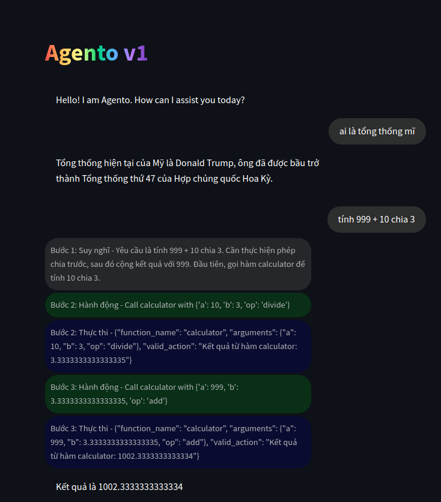

# Agento-v1
- Self-built Function calling AI Agent using model Qwen2.5-72B-Instruct

## Usage
### Install requirement
```sh
pip install requirements.txt
```

### Execution
For run demo:
```python
python main.py
```

Run with UI:
```python
python -m streamlit run function_calling_agents/interface/gui.py
```


## Future plans
- Bổ sung đa dạng các tools để mở rộng khả năng Agent (tự động đăng bài fb...).
- Bổ sung retrieval data cho agents
...
- Xây dựng multi-agents có thể phân chia và cùng nhau thực hiện tác vụ.

## Examples output

